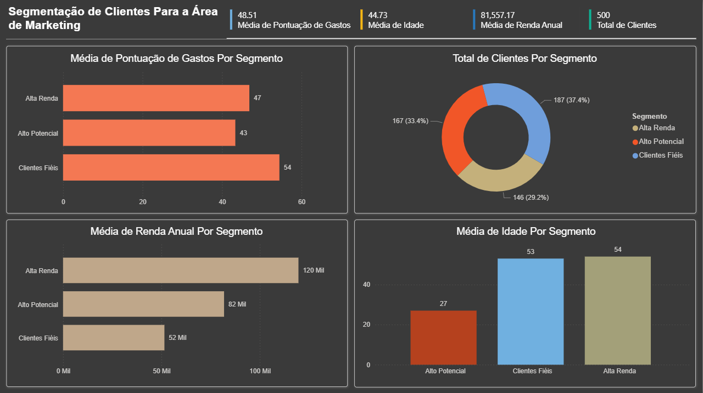
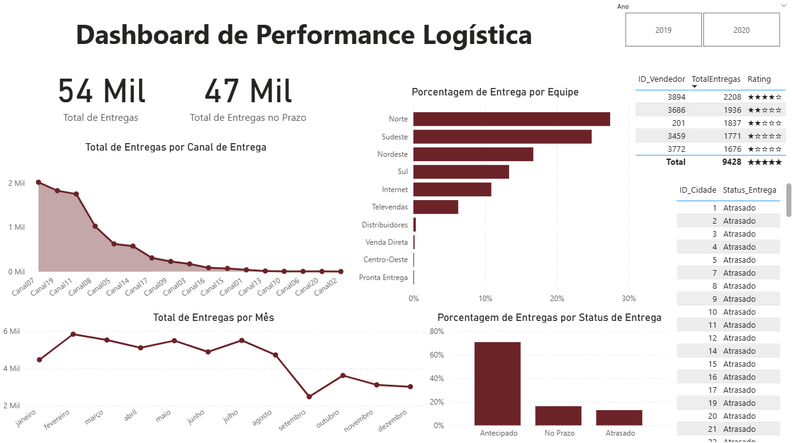

# Portfólio de Projetos de Análise de Dados e Business Intelligence

Neste portfólio, apresento alguns dos meus principais projetos desenvolvidos com foco em Power BI, demonstrando minhas habilidades em ETL, modelagem de dados, criação de KPIs, storytelling e aplicação de técnicas de Machine Learning para análise.

**Ferramentas Principais:** Power BI, DAX, Power Query, SQL, Python.

## Projetos em Destaque

### 1. Análise de Segmentação de Clientes com Machine Learning

* **Objetivo:** Este projeto utiliza um modelo de Machine Learning (clusterização com K-Means) para segmentar clientes de um shopping com base em seu comportamento de consumo. O dashboard foi desenvolvido para que a equipe de Marketing pudesse visualizar e entender profundamente os perfis de cada cluster, permitindo a criação de campanhas personalizadas e mais eficientes.

* **Habilidades e Ferramentas:**

  * Machine Learning (Clusterização com K-Means)

  * Power BI e Power Query

  * DAX (Medidas de agregação)

  * Análise de Perfil de Cliente (Customer Persona)

  * Estratégia de Marketing

* **Análise e Funcionalidades:**

  * **KPIs Gerais:** Cartões de destaque apresentam a média de idade, renda anual e pontuação de gastos de toda a base de clientes, além do número total de clientes analisados.

  * **Distribuição dos Segmentos:** Um gráfico de rosca mostra a distribuição percentual de clientes em cada um dos 3 segmentos identificados.

  * **Análise Comparativa por Segmento:** gráficos comparam as médias de renda anual e pontuação de gastos entre os segmentos "Alta Renda", "Alto Potencial" e "Clientes Fiéis". Essa visão é crucial para o marketing, pois revela, por exemplo, que o segmento "Alto Potencial", com clientes jovens, que possuem renda significativa, porém a menor média de gastos.

* **Impacto de Negócio:** Com esses insights, a equipe de marketing pode direcionar ofertas, criar campanhas e desenvolver estratégias para aumentar o valor do ticket médio dos clientes "Alto Potencial".

### 2. Dashboard de Performance Logística

* **Objetivo:** Fornecer uma visão 360º da operação logística de uma empresa, permitindo o monitoramento de KPIs cruciais como pontualidade, eficiência de canais e satisfação do cliente. O painel foi desenhado para apoiar a tomada de decisão de gestores e a análise detalhada da equipe operacional.

* **Habilidades e Ferramentas:**

  * Power BI (Design de Relatórios e UX)

  * DAX (Cálculo de Percentuais e Indicadores)

  * Power Query (ETL)

  * Storytelling com Dados

  * Análise de Séries Temporais

* **Análise e Funcionalidades:**

  * **KPIs Principais:** Cartões de destaque com o total de entregas realizadas e o **percentual de entregas feitas no prazo**, oferecendo um panorama imediato da eficiência operacional.

  * **Satisfação do Cliente:** Um indicador visual de avaliação em estrelas (Rating) traduz a nota média de satisfação de forma intuitiva.

  * **Análise de Canais:** Um gráfico de barras compara o volume de entregas por canal (E-commerce, Loja Física, App), permitindo a identificação dos canais mais eficientes.

  * **Performance Mensal:** Gráficos de linha e área mostram a evolução do total de entregas e do percentual de pontualidade ao longo dos meses, facilitando a identificação de tendências e sazonalidades.

  * **Detalhes da Operação:** Uma tabela detalhada permite a consulta de entregas individuais por ID e status, essencial para a equipe operacional rastrear e resolver problemas específicos.

  * **Interatividade:** Filtros dinâmicos por Mês e Ano permitem que o gestor explore os dados e analise períodos específicos com facilidade.

## Contato

Agradeço pela sua atenção! Fique à vontade para entrar em contato.

* **LinkedIn:** `linkedin.com/in/rafaelvictorr`

* **Email:** `rafaelredoval8@gmail.com`

